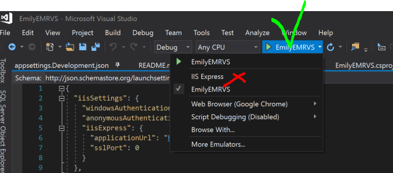
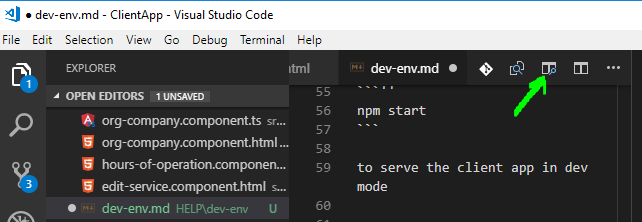
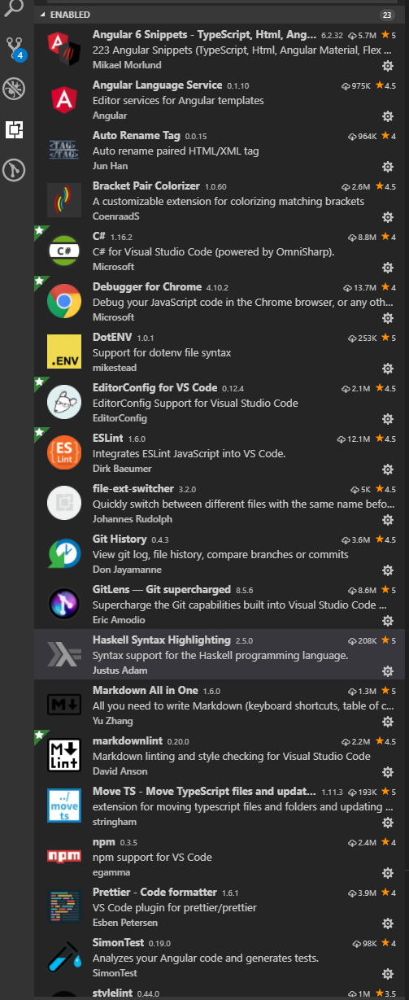

# Development Environment Setup

## First thing first

### 1. Install Visual Studio Code

To install Visual Studio Code, please follow the instructions found at their web site here:

[code.visualstudio.com](https://code.visualstudio.com/)

### 2. Open the ClientApp

To open our Angular client app, please launch Visual Studio Code and then:

1. At the left top, File -> Open Folder
2. Select ClientApp folder in EmployeePortal project folder on the hard disk
3. Click Select Folder to open selected folder and close the dialog.

That is all it takes to open a project in VS Code.

Before you launch the app for the first time,
I would recommend considering these options:

1. Install the latest version of Node.js and NPM (recommended, but this is required if you do not have Node.js installed already)
2. Install a Markdown extension for VS Code to be able easier read this file.

Please find the corresponding topic below in this very file.

## Launch the app

There are two parts we need to launch, the back-end web server which will be serving
our Web API under ASP.NET Core Kestrel web server, and, a development web server which
will be serving our Angular app.

Please note that by now, Kestrel web server has been serving both,
the back-end and the front-end apps. That is why after we stopped it to edit some C# code,
we needed to wait for the front-end to be recompiled by the webpack compiler.
C# compiler Roslyn knows nothing about the front-end so the front-end compiler
has been launched every time just in a case we did some changes. Now when we have two web servers,
we are able to work on front- and back-end projects independently.

### 1. To launch the back-end just launch the back-end ASP.NET project as usually using Visual Studio 2017

Optionally, select EmployeePortal, not IIS Express, as shown on the screenshot:



IIS Express launches Kestrel server anyways so it takes more time to launch both of them then just Kestrel.

### 2. Launch ClientApp

Go back to VS Code and click "Ctrl + ~" (or View -> Terminal in the top menu) to open a terminal
window and then type (or copy and paste) one of the following commands:

```''
npm start
```

to serve the client app in dev mode

or

```''
npm run hmr
```

to serve the client with Hot Module Replacement turned on (recommended).
When you use this option, after you save changes, only the components
affected by the changes get recompiled and served to the browser which
is much faster than to recompile the whole app.

## Install the latest version of Node.js

Go to [nodejs.org](https://nodejs.org)
and install the Long Term Support (LTS) version (8.12.0 LTS at the time of this writing.)

After the installation finished, please verify version typing in a terminal (Command Prompt or any other) the following command:

```''
node -v
```

The response should be just the current version of Node (if not, please follow the instructions on the screen to troubleshoot the issue).

## Install the latest version of "npm" package manager globally

In a terminal, type:

```''
npm i npm -g
```

## Install "must to have" (and not) VS Code extensions

Open VS Code. View->Extensions (or, Ctrl+Shift+X). Search and install:

### 1. Markdown All in One (optional)

After installing "Markdown All in One" extension, optionally, please open this very file in VS Code
and then click on the "Preview" icon at the right-top edge of VS Code as shown on the screenshot:



### 2. Prettier formatter for Visual Studio Code ("must have")

Prettier is enforces a consistent style by parsing your code and re-printing it with its own rules that take the maximum line length into account, wrapping code when necessary.

### 3. vscode-tslint ("must have")

Integrates the tslint linter for the TypeScript language into VS Code.

### 4. vscode-icons (very recommended)

### 5. Bracket Pair Colorizer (recommended)

### 6. Git History (recommended)

### 7. GitLens supercharges (recommended)

### 8. Debugger for Chrome (nice to have)

### 8. Haskell Syntax Highlighting (kidding :)

Please feel free to install any other extension shown on the screenshot below
(or any other you like) and, if you like it after trying it, please add it to this list.



## If you have questions

regarding this Dev Env setup, please contact me (natalie@cyberiny.com)
